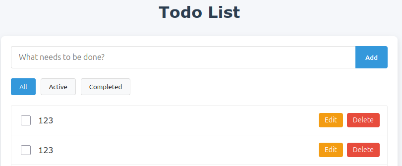

## Список планируемых тестов

Т.к. время на выполнение тестового задания ограничено, реализованы CRIT-тесты. Не все возможные тестовые случаи.

- Позитивные сценарии:

  - Отображение списка задач.
  - Создание задачи.
  - Отметка задачи как выполненной.
  - Редактирование задачи.
  - Удаление задачи.
  - Фильтрация: All, Active, Completed.

- Негативные сценарии:
  - Создание задачи с пустым названием.
  - Создание задачи с длинным названием.
  - Создание задачи с тем же названием. (создан только шаблон. надо уточнить требования у аналитиков или разработчиков - не создавать? выдавать ошибку? добавлять постфикс?)
  - Редактирование задачи на пустое значение.

## Описание использованных подходов

- Подходы тестирования:

  - Граничные значения: тк № TS00006 и TS00007.
  - Причинно-следственный анализ
  - Прогнозирование ошибок тк № TS00006, TS00008
  - Диаграмма состояний тк № TS00007
  - E2E тестирование тк № TS00007

- Подходы автоматизации:
  - Использую PageObject для хранения локаторов и методов страницы в одном месте. И использования их в тестах.
  - В тесте № TS00006 я использовала скриншотное тестирование. Чтобы проверить отображение элемента с переносами и в нужном размере/шрифте.
  - Тест-кейсы делаю атомарными и независимыми. Это позволяет легко их поддерживать и быть тестам более стабильными и понятными, чем объемные end-to-end тесты, которые так же необходимы, но не должны составлять костяк автоматизации.
  - API тестирование тк № TS00007. Проверяю, что при попытке создать задачу с пустым наименованием не создается POST запрос.

## Обнаруженные баги

Ко всем багам приложены скриншоты. Файл со скриншотами можно увидеть здесь [REPORT.md](https://github.com/VeronicaKo/angular-todo-app/blob/375c1f1440a728a19c538a3e74bc23a8c728c0ac/REPORT.md)

### №001 При добавлении задачи, чье имя превышает 56 символов и не содержит пробелы, добавленная задача выходит за границы списка задач.

**Steps:**

1. Открыть страницу http://localhost:4200.
2. Добавить задачу, чье название превышает 56 символов. Например '888888888888888888888888888888888888888888888888888888888888888888'

**Expected:** Задача добавлена в список.
Название задачи переносится/обрезается.

**Actual:** Название задачи уходит за границы списка.

**Environment:** Chrome 138.0.7204.92

### №002 При удалении одной из только что созданных задач, удаляются обе задачи.

**Steps:**

1. Открыть страницу http://localhost:4200.
2. Добавить две задачи.

3. Удалить одну из добавленных задач.

**Expected:** Удалена отмеченная задача

**Actual:** Удалены обе задачи

**Environment:** Chrome 138.0.7204.92

**Notes:** связаный баг №003.

### №003 При создании задач им присваивается одинаковый id.

**Steps:**

1. Открыть страницу http://localhost:4200.
2. Добавить три задачи.

**Expected:** Каждая задача имеет уникальный id

**Actual:** Все задачи имеют одинаковый id

**Environment:** Chrome 138.0.7204.92

### №004 При редактировании задачи на пустое значение, она сохраняется.

**Steps:**

1. Открыть страницу http://localhost:4200.
2. Отредактировать задачу, оставив поле 'Название задачи' пустым.

**Expected:** Задача не сохраняется

**Actual:** Задача сохраняется с пустым названием

## Предложения по улучшению тестов

Сложно давать предложения, не видя проект тестов. Может в вашем проекте уже всё идеально и остается только наполнять. Скажу, чтобы я сделала в своем проекте:

1. Добавление тестовых данных не через интерфейс, а через API - это быстрее
2. Скриншотное тестирование каждой страницы при первом использовании. Быстро проверяет что где пропало и съехало
3. Шаги тестов, объясняющие бизнес логику выполняемых действий человеческим языком (TS00007)
4. Разбить все огромные тесты на небольшие.
5. Независимые тесты. Не пересекаюшиеся данные

## Сложности, возникшие при выполнении

Нестабильный стенд заставил понервничать. И поскольку не было возможности связаться с разработкой, пришлось искать выход.
Сложно понять когда достаточно, не зная, чего ждут, улычшать тесты и увеличиать покрытия можно довольно долго.
Но, впринципе я довольна тем, что получилось.

## Версии программного обеспечения

- node v20.11.0
- npm v10.2.4
- playwright v1.53.2
