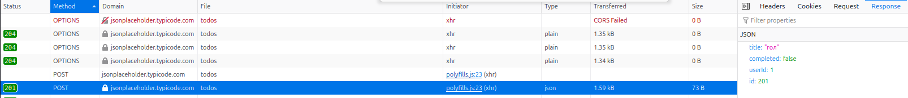
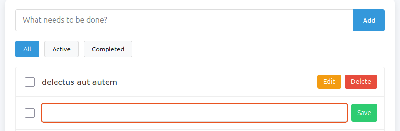
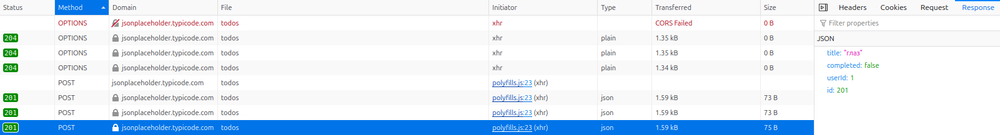
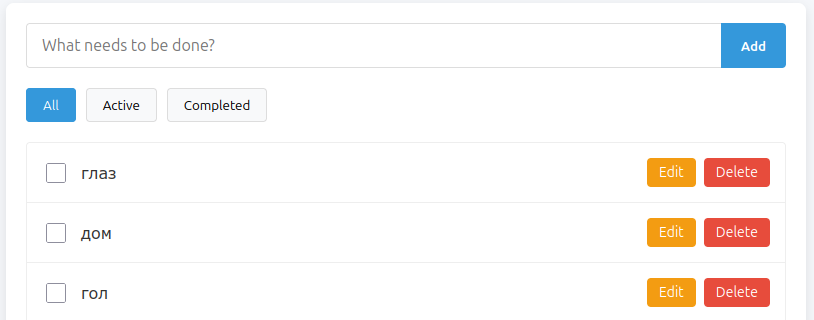

## Список планируемых тестов

Т.к. время на выполнение тестового задания ограничено, реализованы CRIT и HIGH тесты. Не все возможные тестовые случаи.

- Позитивные сценарии:

  - Отображение списка задач.
  - Создание задачи.
  - Отметка задачи как выполненной.
  - Редактирование задачи.
  - Удаление задачи.
  - Фильтрация: All, Active, Completed.

- Негативные сценарии:
  - Создание пустой задачи.
  - Редактирование на пустое значение.

## Описание использованных подходов

## Обнаруженные баги

### Задачи не отображаются в списке(движок Blink-WebKit)

**Steps:**

1. Открыть страницу http://localhost:4200.

**Expected:** Задачи отображаются в списке.

**Actual:** Задачи не отображаются в списке.

**Environment:** Chrome 138.0.7204.92, Opera 120.0.5543.38

**Notes:** В Edge(138.0.3351.77) и Firefox(140.0.2 (64-разрядный)) задачи отображаются

## Предложения по улучшению тестов

-

## Сложности, возникшие при выполнении

## Версии программного обеспечения

- node v20.11.0
- npm v10.2.4
- playwright v1.53.2
